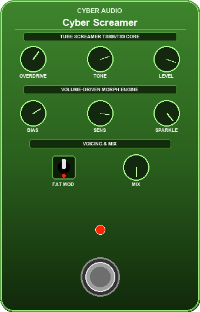

# Cyber Piezo Thump Killer LV2

A dedicated acoustic guitar under-saddle piezo processor engineered to eliminate destructive low-end mechanical saddle thumps, body shockwaves, and hollow soundbox mud in real-time, while preserving 100% of natural acoustic warmth and dynamic range.

Includes a **Zero-Latency Soft-Knee Spike Clamp** specifically designed to stop acoustic piezo transients from overloading Neural Amp Modeler (NAM) models!

## Why It\'s Needed

Under-saddle piezo pickups are capacitive quartz/ceramic pressure sensors. When you slap, palm-mute, or dig into the low strings, they produce massive physical shockwaves (+15 to +20 dB) that distort preamps, blow out subwoofers, and violently clip non-linear neural amp models (WaveNet).

Static EQs permanently suck the body and warmth out of your guitar. **Cyber Piezo Thump Killer** is **100% dynamic and transparent**:
* When fingerpicking softly, all filters stay completely flat at 0 dB (zero tone suck).
* When a violent thump or pick spike occurs, the surgical notches and safety clamp engage in ~1.5 ms and release smoothly in 60 ms.

## Features

* **Sub-Rumble High-Pass Filter (20–100 Hz)**: 2nd-order Butterworth HPF killing sub-audible stage vibrations and handling noise.
* **Band 1: Dynamic Sub-Thump Notch (60–180 Hz)**: Narrow surgical notch (0 to -24 dB cut) targeting low-E mechanical saddle shockwaves.
* **Band 2: Dynamic Body-Mud Notch (150–400 Hz)**: Smooth notch (0 to -18 dB cut) removing hollow \'cardboard box\' soundhole resonance.
* **Automatic Harmonic Satellite Tracking**:
  * **Fundamental ($)**: 100% cut
  * **2nd Harmonic ($)**: Automatically receives **75%** of the reduction at narrow surgical Q.
  * **3rd Harmonic ($)**: Automatically receives **25%** of the reduction.
  * Completely tames the \'plastic click\' and harsh mechanical overtones accompanying the bass boom.
* **Zero-Latency Soft-Knee SPIKE CLAMP (-12 to 0 dB, default -4 dB)**:
  * **0 samples latency** (no lookahead, live-ready).
  * 1:1 bit-exact dynamic passthrough for 95% of playing.
  * Hyperbolic soft ceiling smoothly rounds off microsecond piezo spikes so downstream NAM models **never clip**.
* **Audition / Listen Mode**:
  * Solo the Thump or Mud detection band to sweep the frequency knob and lock onto your guitar\'s exact resonance in seconds.
* **Acoustic Mahogany & Brushed Brass MOD-UI**: Real-time gain reduction activity LEDs for both bands.

## Building

`ash
# Windows x64:
g++ -shared -O3 -fPIC -static-libgcc -static-libstdc++ -I../../include -o cyber_piezo_thump_killer.dll src/cyber_piezo_thump_killer.cpp

# Linux / Raspberry Pi:
g++ -shared -O3 -fPIC -o cyber_piezo_thump_killer.so src/cyber_piezo_thump_killer.cpp
`

## License

GPL-3.0 License. Developed by CyberAudio.
