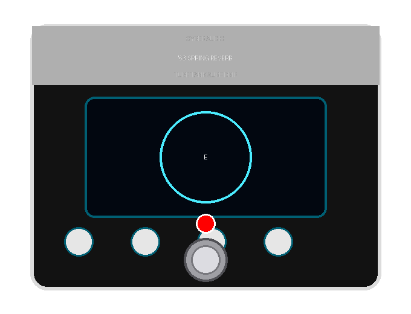

# Cyber \'63 Spring Reverb LV2

An authentic physical-modeling recreation of the legendary **1963 Fender 6G15 standalone tube spring reverb tank**, built for MOD Desktop, MODEP (Raspberry Pi 5/4), and standard LV2 hosts.

## Features

* **16-Stage Dispersive Allpass Cascade (\'Chirp / Drip\')**: Recreates the frequency-dependent speed of sound in coiled spring wire, producing the signature splashy \'boing\' and surf-rock drip on pick attacks.
* **3 Coupled Spring Delay Lines**: Non-commensurate prime delay lengths with mechanical reflection feedback and cross-coupling matrices to simulate real tank acoustics.
* **6V6 / 12AX7 Tube Preamp Saturation**: Warm vacuum tube drive and harmonic warmth when pushing the Dwell control.
* **Full Control Set**:
  * **Dwell (0–100%)**: Tube input drive pushing the spring tank into lush saturation.
  * **Tone (0–100%)**: High-frequency absorption and vintage tank brightness.
  * **Mix (0–100%)**: Dry / Wet reverb blend.
  * **Drip (0–100%)**: Intensity of the physical spring dispersion chirp.
  * **Decay (0–100%)**: Reverb tail length and mechanical spring damping.
* **Official MOD GUI**: Textured 1963 brownface chassis with 5 vintage cream fluted knobs and responsive audio connectors.

## Building

`ash
# Build with GCC (Windows x64):
g++ -shared -O3 -fPIC -static-libgcc -static-libstdc++ -I../../include -o cyber_spring_reverb.dll src/cyber_spring_reverb.cpp

# Linux (Raspberry Pi / x86_64):
g++ -shared -O3 -fPIC -o cyber_spring_reverb.so src/cyber_spring_reverb.cpp
`

## License

GPL-3.0 License. Developed by CyberAudio.
